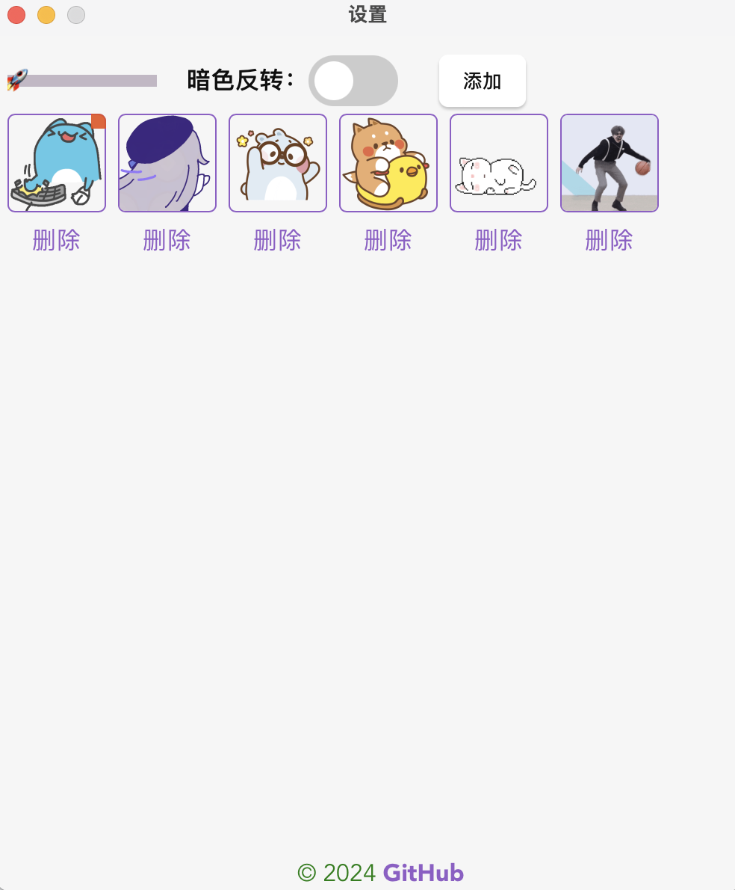

  

### 让系统托盘的图标动起来(只支持 gif)

### 软件截图

  
  
  

### 注意⚠️⚠️⚠️
此软件会占用极大的内存 

### TODOS

暂无

## ✨

### Tauri 踩坑笔记

[踩坑笔记](https://gist.github.com/itxve/cbb94eb509bc8e98e71cc0457b3d4be8)

### 灵感来源

[https://github.com/W-Mai/BuZhiYin](https://github.com/W-Mai/BuZhiYin)
